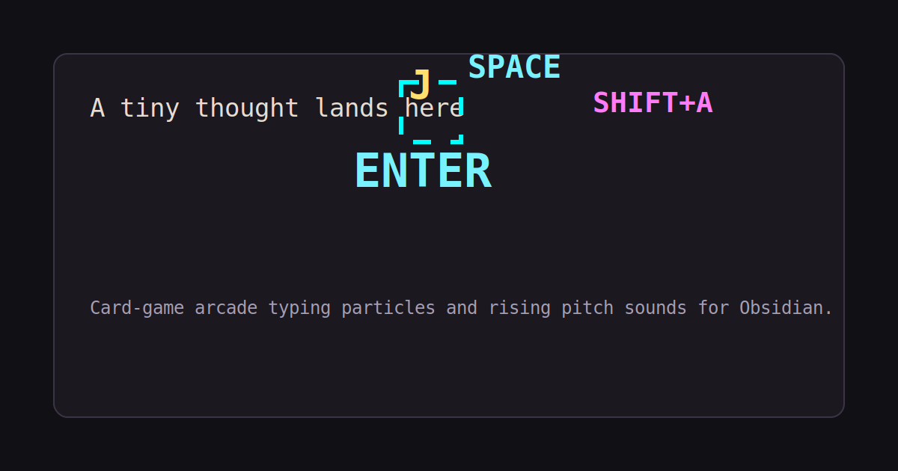
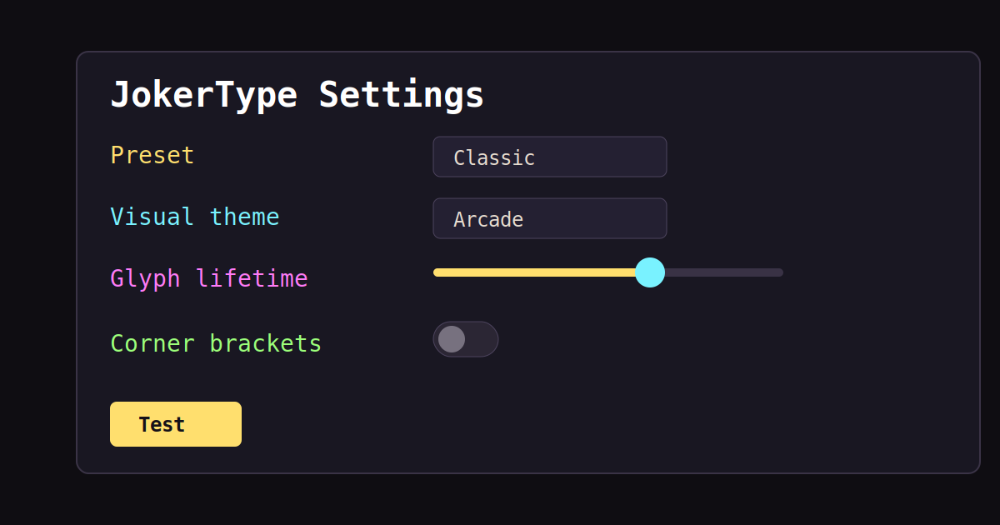

# JokerType

JokerType is a desktop-first Obsidian plugin that makes typing feel game-like: pixel glyph particles, special-key labels, rising-pitch typing sounds, and configurable visual themes inspired by HyperType and card-game arcade feedback.



## Features

- Floating pixel text for typed characters, `SPACE`, `ENTER`, `TAB`, `BACKSPACE`, `DELETE`, and paste.
- HyperType-style sampled sounds with pitch rising during fast typing streaks.
- Visual themes: Arcade, Neon, Monochrome, and Terminal.
- Presets: Subtle, Classic, Chaotic, and Sound only.
- Fine-grained toggles for text glyphs, enter effects, delete effects, corner brackets, editor shake, and status combo counter.
- Controls for volume, sound style, effect intensity, glyph lifetime, reduced motion, and large paste throttling.
- Test effect button for quick tuning.



## Installation

Copy the built plugin folder into:

```text
<vault>/.obsidian/plugins/jokertype
```

Then enable Community plugins and turn on JokerType.

## Settings

Start with `Classic`, then tune from there. `Subtle` is calmer for long writing sessions, `Chaotic` is intentionally loud and flashy, and `Sound only` keeps the audio streak feel without visual particles.

Use `Glyph lifetime` to tune how long particles remain visible. Disable `Corner brackets` if the bracket bursts feel too busy.

## Privacy and permissions

JokerType does not use telemetry, ads, analytics, accounts, network requests, or external file access. It observes editor transactions inside Obsidian, stores plugin settings with Obsidian's plugin data API, and plays local embedded audio assets.

## Development

Install dependencies:

```bash
npm install
```

Run tests:

```bash
npm test
```

Build:

```bash
npm run build
```

## Credits

JokerType uses HyperType as an implementation reference and includes attributed HyperType font and sound assets. See [THIRD_PARTY_NOTICES.md](THIRD_PARTY_NOTICES.md).

## Changelog

See [CHANGELOG.md](CHANGELOG.md).
